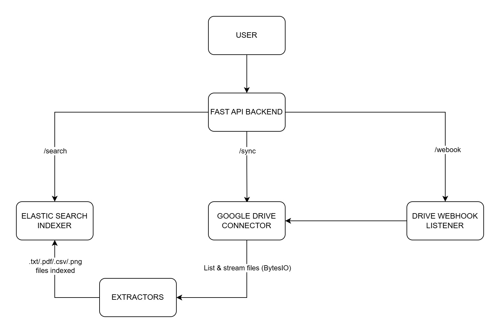

# Document Search App (Google Drive + Elasticsearch)

This project is a **real-time document search service** that indexes the contents of files stored in your Google Drive and enables searching via a REST API. It leverages:

- Google Drive API for reading files (.txt, .pdf, .csv, .png)
- Elasticsearch for full-text search
- FastAPI for backend API
- Webhook-based real-time (Event Based) updates using Google Drive Push Notifications
- Ngrok for exposing your local server to receive webhook notifications

---

## Features

- Extracts content from `.txt`, `.csv`, `.pdf`, and `.png` files in Google Drive
- Uses MIME-type-specific extractors
- Indexes metadata + content in Elasticsearch
- Powerful full-text search across files via REST API
- Automatically syncs on file change using **Google Drive webhook**
- Ngrok tunnel for webhook registration

---

## Prerequisites

Before starting, ensure the following are installed:

| Requirement      | Install Command |
|------------------|------------------|
| Python (>= 3.8)  | _Already assumed_ |
| Ngrok            | [Install Ngrok](https://ngrok.com/download) |
| Docker           | [Install Docker](https://docs.docker.com/get-docker/) |
| Google Cloud Project | Needed to get Drive API credentials |

---

## Step 1: Setup Google Drive API

1. Visit [Google Cloud Console](https://console.cloud.google.com/).
2. Create a new project.
3. Enable **Google Drive API**.
4. Go to **OAuth Consent Screen** and configure as required.
5. Go to **Credentials** → Create **OAuth client ID** (choose Desktop App).
6. Download `credentials.json` and place it in:
   ```bash
   googledrive-document-search-app/config/credentials.json
   ```
Note:
It is recommended to secure sensitive files like credentials.json using a cloud Key Vault service, such as:
1. Google Secret Manager
2. Azure Key Vault
3. AWS Secrets Manager
This ensures your OAuth credentials are not exposed in the file system or version control.

---

## Step 2: Install Tesseract OCR (Required for PNG Extraction)

### 🔹 Windows

1. Download the Windows installer from:  
      https://github.com/UB-Mannheim/tesseract/wiki  
      (Choose the version matching your architecture and language.)

2. Install it, and note the installation path (e.g., `C:\Program Files\Tesseract-OCR`).

3. Add the installation path to your **System PATH** environment variable.

### 🔹 macOS

```bash
brew install tesseract
```

### 🔹 Linux (Ubuntu/Debian)

```bash
sudo apt update
sudo apt install tesseract-ocr
```

---

## Step 3: Install Ngrok & Configure

### Install Ngrok

- [Download from here](https://ngrok.com/download)
- After install, run the following **once**:

```bash
ngrok config add-authtoken <your-ngrok-token>
```

(Find your token under https://dashboard.ngrok.com/get-started/your-authtoken)

---

## Step 4: Install Dependencies

```bash
cd googledrive-document-search-app
python -m venv venv
venv\Scripts\activate  # or `source venv/bin/activate` on Mac/Linux
pip install -r requirements.txt
```

---

## Step 5: Start App (Manual Way)

### Terminal 1: Start Elasticsearch

> You must have Docker installed.

```bash
docker run -d -p 9200:9200 -e "discovery.type=single-node" elasticsearch:7.17.10
```

### Terminal 2: Start Ngrok

```bash
ngrok http 8000
```

Copy the HTTPS URL (e.g., `https://abcd1234.ngrok-free.app`)

#### Set webhook URL

Update `.env` file with:

```env
WEBHOOK_URL=https://abcd1234.ngrok-free.app/api/drive-webhook
```

### Terminal 3: Register the webhook

```bash
python scripts/register_drive_webhook.py
```

You’ll see output like:

```
Start page token: 218
Watch registered successfully.
Channel expires at: 2025-07-25 10:00:00
```

#### First-Time Authentication

On first run, the app will launch a browser window asking for permission to access your Google Drive.

- A `token.json` will be generated and stored automatically.
- If token expires or is missing, the app will prompt again.

### Terminal 4: Run the API

```bash
uvicorn main:app --reload
```

---

## Step 6: Run via Script

To launch everything with a single command (Ngrok + ES + Webhook):

```bash
startup.bat   # On Windows
./startup.sh # On Mac/Linux
```

This does the following:
- Activates virtual environment
- Starts Elasticsearch (if not running)
- Starts Ngrok
- Dynamically updates `.env` with Ngrok webhook URL
- Registers the webhook
- Starts FastAPI app

---

## API Endpoints

### Health Check

```
GET /api/health
```

### Manual Sync (Optional)

```
POST /api/sync
```

Triggers sync manually if needed.

### Search Documents

```
GET /api/search?q=invoice
```
or

```
curl http://localhost:8000/api/search?q="invoice"
```

Returns list of matching file names from Drive.

---

## File Types Supported

| Type | Extension | Notes |
|------|-----------|-------|
| Text | .txt      | Plain text |
| CSV  | .csv      | Extracted as comma-separated lines |
| PDF  | .pdf      | Extracted using PyPDF2 |
| Image| .png      | OCR applied via pytesseract |

---

## Configuration

The application uses environment files for managing configuration. `.env.config`, contains system parameters like file size limits and credential paths.

```env
CREDENTIALS_PATH=config/credentials.json
TOKEN_PATH=config/token.json
MAX_FILE_SIZE_MB=2
```

---

## High-Level Design Diagram

The following diagram illustrates the architecture of the Document Search Application:



---

## Directory Structure

```
.
├── app
│   ├── api/                  # FastAPI routes + webhook
│   ├── connectors/           # Google Drive integration
│   ├── extractors/           # File-type-specific text extractors
│   ├── indexers/             # Elasticsearch indexing/search
│   └── services/             # Sync logic
├── scripts/                  # Webhook registration script
├── config/                   # credentials.json + token.json
├── main.py                   # FastAPI app with initial sync
├── tests/                    # Contains unit test files
├── .env                      # Contains WEBHOOK_URL
├── requirements.txt
├── startup.bat / startup.sh      # Optional automation scripts
```

---

## Known Limitations

- Google Drive webhooks (registered via changes().watch) expires every 7 days (maximum allowed)
- OCR may fail on noisy/scanned images
- Max file size: 2MB (can be configured in .env.config)